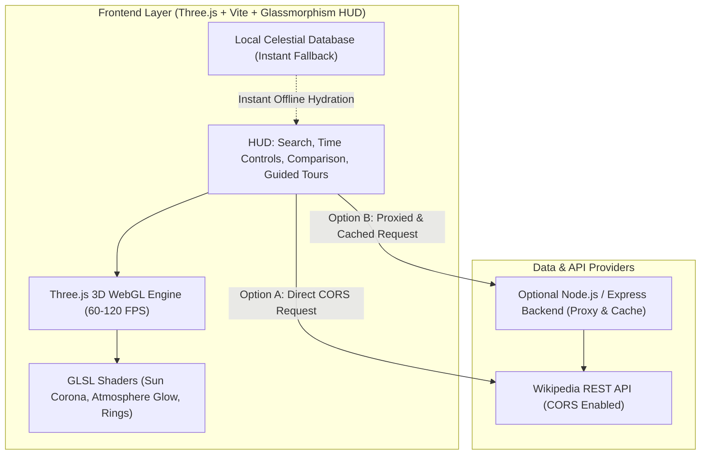

# 3D Solar System & Deep Space Explorer: Implementation Plan

## Goal Description
Build a state-of-the-art, high-performance 3D interactive Solar System web application where users can explore, learn about, and interact with all celestial bodies: the Sun, all 8 major planets, dwarf planets, major and minor moons, asteroid belts, comets, and meteors. The application connects dynamically with the **Wikipedia REST API** to stream rich encyclopedic summaries, high-resolution NASA/Wikimedia images, and articles, backed by a local astronomical dataset for instant zero-latency loading.

The application emphasizes cinematic aesthetics, 60–120 FPS performance via WebGL/Three.js with instanced rendering, realistic orbital mechanics, custom GLSL shaders (Sun corona, atmospheric Rayleigh glow, Saturn ring shadows), dual-scale viewing (Explorer vs True Scale), size comparison widgets, planetary cross-section infographics, guided cosmic tours, and an ambient procedural space soundscape.

---

## User Review Required: Backend Architecture Choice

> [!IMPORTANT]
> **Is a Backend Required?**
> The current baseline is a **high-performance client-side application** because:
> 1. **Wikipedia has open CORS**: The Wikipedia REST API (`https://en.wikipedia.org/api/rest_v1/page/summary/{title}`) has `Access-Control-Allow-Origin: *`, allowing browsers to fetch live summaries and photos directly without needing a proxy server.
> 2. **Client-side GPU simulation**: All Keplerian orbits, Three.js shaders, 15,000+ instanced asteroids, and audio synthesis run locally in the browser on the user's GPU.
> 3. **Instant static deployment**: Pure frontend can be deployed anywhere (Vercel, GitHub Pages, Netlify, Cloudflare Pages) with 0 hosting costs and 0 server maintenance.
>
> However, a **Node.js / Express Backend** can be added if you desire:
> - **Server-side persistent caching**: Cache Wikipedia responses and NASA imagery to disk/SQLite so the app works seamlessly offline even after browser cache clears.
> - **NASA API proxy**: Securely proxy NASA JPL Horizons Ephemeris API or NASA APOD (Astronomy Picture of the Day) without exposing API keys.
> - **Interactive Quiz & Progress Tracking**: Save user quiz scores, discovery achievements, and customized planet bookmarked tours.

---

## Open Questions

> [!NOTE]
> Which architecture do you prefer?
> 1. **Option A (Recommended - Pure Frontend SPA)**: Blazing-fast Three.js + Vite + TypeScript. Direct Wikipedia API calls with local cache & offline dataset. No backend server needed, runs with a single command, zero maintenance.
> 2. **Option B (Full-Stack with Node.js/Express)**: Vite frontend + Node.js/Express backend API for server-side Wikipedia caching, NASA API proxy, and quiz progress tracking.

---

## System Architecture



---

## Proposed Changes

### 1. Build System & Project Configuration
Initialize a modern, ultra-fast Vite + TypeScript project with Three.js, Lucide icons, and modern styling.

#### [NEW] `package.json`
- Dependencies: `three`, `@types/three`, `lucide`
- DevDependencies: `vite`, `typescript`
- Optional Backend dependencies (if Option B): `express`, `cors`, `dotenv`

#### [NEW] `vite.config.ts`
- Optimized bundling, asset handling, dev server port 3000.

#### [NEW] `tsconfig.json`
- Strict TypeScript configuration for modern ES2022.

---

### 2. Astronomical Data & Wikipedia Integration

#### [NEW] `src/data/celestialBodies.ts`
Comprehensive catalog of every celestial body in the Solar System:
- **Central Star**: Sun (G2V, photosphere, corona, solar wind)
- **Terrestrial Planets**: Mercury, Venus, Earth, Mars
- **Gas & Ice Giants**: Jupiter (95 moons), Saturn (146 moons, rings), Uranus (rings, tilt), Neptune
- **Dwarf Planets**: Pluto (heart glacier, Charon binary), Ceres (asteroid belt), Eris, Haumea (rapid spin, ring), Makemake
- **Moons Database**:
  - Detailed 3D rendered models for all major moons (Luna, Phobos, Deimos, Io, Europa, Ganymede, Callisto, Titan, Enceladus, Mimas, Triton, Charon, etc.)
  - Complete directory of all known 290+ moons categorized by host planet
- **Small Solar System Bodies**:
  - Main Asteroid Belt (Ceres, Vesta, Pallas + 15,000 instanced asteroids)
  - Trojan Asteroids & Kuiper Belt
  - Comets with dynamic solar-wind oriented tails: Halley, NEOWISE, Hale-Bopp, 'Oumuamua
  - Meteor Showers guide: Perseids, Geminids, physics of meteoroids vs meteors vs meteorites

#### [NEW] `src/services/wikipediaService.ts`
- Client for Wikipedia REST API:
  - Fetches summary extracts, thumbnails, original images, descriptions, page links
  - Intelligent in-memory caching to eliminate redundant network roundtrips
  - Sanitization of Wikipedia HTML formatting

---

### 3. Core 3D Graphics & Simulation Engine

#### [NEW] `src/core/SolarSystemApp.ts`
- Main entry point orchestrating Three.js Scene, PerspectiveCamera, WebGLRenderer, OrbitControls, and Animation Loop.
- Resize handler, DPR clamping for high-DPI retina screens, performance throttling.

#### [NEW] `src/core/CelestialBodyMesh.ts`
- Hierarchical scene graph representation:
  - `OrbitGroup` -> rotates at Keplerian frequency
  - `PositionAnchor` -> semi-major axis distance
  - `TiltGroup` -> real axial tilt
  - `BodyMesh` -> daily rotation around spin axis
  - `AtmosphereMesh` -> Fresnel rim shader layer
  - `RingMesh` -> Saturn and Uranus rings with custom transparent double-sided texture
  - `OrbitLine` -> Elliptical orbital trajectory visualizer

#### [NEW] `src/core/TextureGenerator.ts`
- High-fidelity procedural texture synthesis on HTML5 Canvas:
  - Sun plasma noise, Mercury craters, Venus cloud banding, Earth oceans/continents/clouds/specular, Mars iron oxide deserts & ice caps, Jupiter gas bands & Great Red Spot, Saturn golden bands & rings, Uranus cyan haze, Neptune deep azure & storms, Europa ice fractures, Moon cratered regolith.
  - Ensures 100% offline availability and zero broken images.

#### [NEW] `src/core/Shaders.ts`
- **Sun Corona Shader**: Animated multi-octave simplex/Perlin noise GLSL shader displaying surging solar plasma, granules, and dynamic flares.
- **Atmosphere Fresnel Shader**: Physically inspired Rayleigh scattering rim glow for Earth, Venus, Titan, Jupiter, and Neptune.

#### [NEW] `src/core/InstancedBelts.ts`
- High-performance `InstancedMesh` system:
  - Main Asteroid Belt (15,000+ individual rocky asteroids with randomized irregular shapes, varying rotational velocities).
  - Kuiper Belt (thousands of icy fragments orbiting beyond Neptune).
  - Trojan Asteroids (clusters at 60° leading and trailing Jupiter).
  - All rendered in single GPU draw calls for 120 FPS performance.

#### [NEW] `src/core/CometSystem.ts`
- Comets with dynamic dual tails:
  - Ion/gas tail (bright cyan-white, pointing strictly opposite to the Sun vector)
  - Curved dust tail (soft golden-white, trailing along orbital path)

#### [NEW] `src/core/CameraDirector.ts`
- Smooth cinematic camera transitions:
  - Smooth interpolation (cubic bezier / slerp quaternion lerp) when user clicks any planet or moon.
  - "Follow Target" mode: Locks camera frame of reference to a revolving planet or moon.
  - Preset viewpoints: Top-down Solar System view, Ecliptic plane view, Close-up view.

#### [NEW] `src/core/AudioEngine.ts`
- Native Web Audio API synthesizer generating a subtle, calming cosmic ambient drone with harmonics and gentle lowpass filter sweeps.
- UI audio cues for button clicks and deep-space zoom whooshes.
- 100% generated in real-time in code (0 MB network transfer, instant on/off).

---

### 4. Interactive UI & Educational Features

#### [NEW] `src/ui/HUD.ts` & `src/ui/SidebarInspector.ts`
- **Glassmorphism Sci-Fi Interface**:
  - Live Wikipedia Overview: real-time article extracts, mission photos, Wikipedia link.
  - Scientific Fact Sheet: Mass, Radius, Surface Gravity, Orbital Period, Rotation Period, Distance from Sun, Mean Temperature, Atmosphere Composition.
  - Moon Explorer: If the selected planet has moons, lists all moons with a 1-click "Fly to Moon" button.
  - Planetary Interior Cross-Section view: Interactive diagram showing Core, Mantle, Crust, Atmosphere layers.

#### [NEW] `src/ui/SearchBar.ts`
- Instant fuzzy search modal with keyboard shortcut (`/` or `Ctrl+K`).
- Search over 300+ celestial bodies (Sun, planets, moons, asteroids, comets).
- 1-click navigation with smooth camera fly-to.

#### [NEW] `src/ui/TimeControls.ts`
- Time flow control: Pause, Play, Reverse, 0.5x, 1x, 10x, 50x, 250x, 1000x real-time speed.
- Time Scrubber: Scrub to see past or future alignments of the planets.

#### [NEW] `src/ui/ComparisonModal.ts`
- Visual side-by-side comparison tool:
  - Pick any two celestial bodies (e.g. Earth vs Jupiter, Moon vs Ganymede, Sun vs Earth).
  - Renders both objects side-by-side in true relative scale with interactive 3D rotation and comparative stats bars.

#### [NEW] `src/ui/TourGuide.ts`
- Guided Narrated Tours:
  - "The Inner Terrestrial Worlds"
  - "The Gas & Ice Giants"
  - "Ocean Worlds: Search for Extraterrestrial Life (Europa, Enceladus, Titan)"
  - "Wanderers of the Deep: Comets & The Kuiper Belt"
  - Automatically pilots the camera across the Solar System while displaying curated historical and scientific stories.

---

## Verification Plan

### Automated Build & Code Quality Tests
1. **TypeScript Type Check**:
   ```cmd
   cmd.exe /c npm run build
   ```
2. **Vite Development Server Verification**:
   ```cmd
   cmd.exe /c npm run preview
   ```

### Manual Verification
1. **3D Visual & Performance Check**:
   - Verify 60+ FPS on standard screen resolution.
   - Inspect the Sun: animated coronal plasma, solar flares, radiant glow.
   - Inspect Earth: rotating cloud layer, night city lights, atmospheric scattering rim.
   - Inspect Saturn & Uranus: translucent ring systems with proper tilt and lighting.
   - Inspect Asteroid & Kuiper Belts: smooth rotation of 15,000+ instanced asteroids without frame drops.
2. **Wikipedia Integration**:
   - Click on Sun, Earth, Europa, Titan, Ceres, Halley's Comet: verify real-time Wikipedia summary, thumbnail images, and encyclopedic stats load cleanly.
   - Disconnect network or test offline: verify pre-bundled fallback facts load without error.
3. **Scale Modes**:
   - Toggle between **Explorer Mode** and **True Scale Mode**: confirm smooth camera adjustment and visual accuracy.
4. **Moons & Small Bodies**:
   - Open Jupiter: check Galilean moons orbiting Jupiter, open Saturn: check Titan and Enceladus, open Mars: check Phobos and Deimos.
   - Check Comets with glowing tails pointing radially away from the Sun.
5. **Interactive Tools**:
   - Test Search Bar (search "Europa", "Halley", "Titan").
   - Test Comparison Tool (compare Earth vs Jupiter, Moon vs Titan).
   - Test Guided Tours (verify automated camera pathing).
   - Test Time Controls (pause, fast-forward, reverse).
   - Test Audio toggle (procedural cosmic synthesizer audio plays softly and mutes cleanly).
